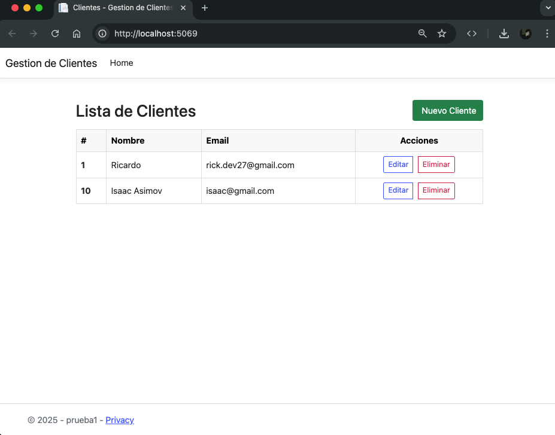
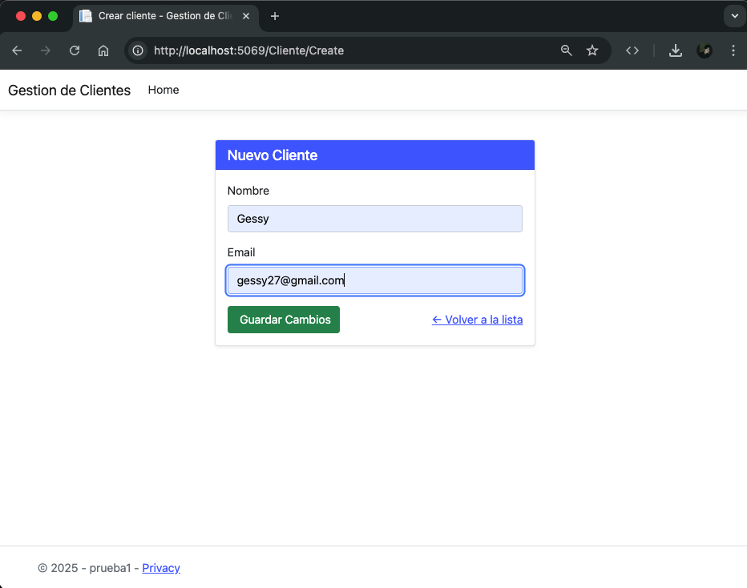
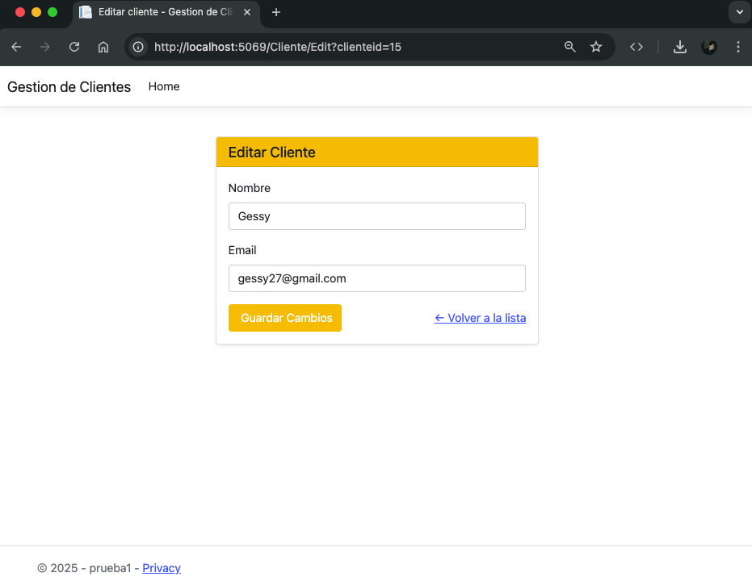
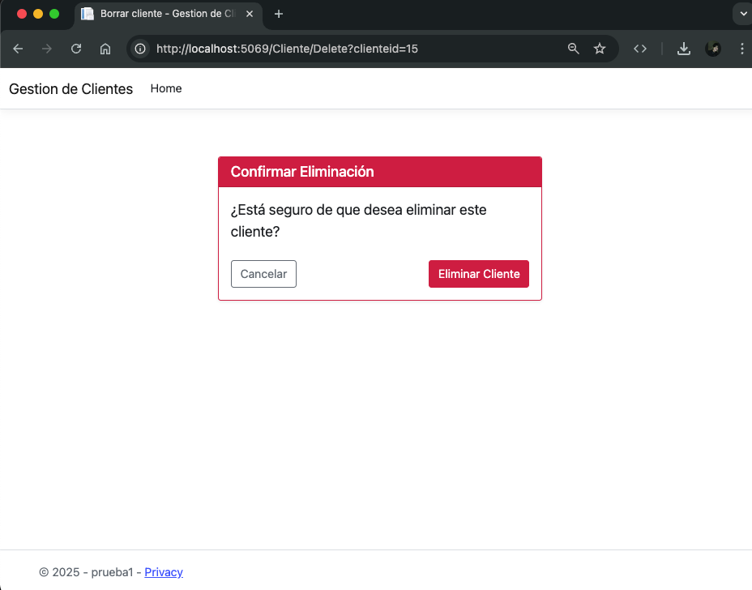
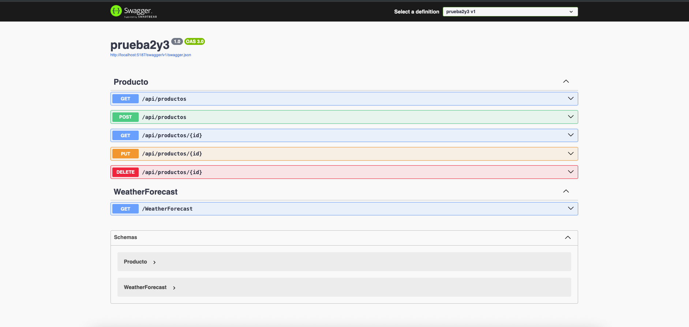
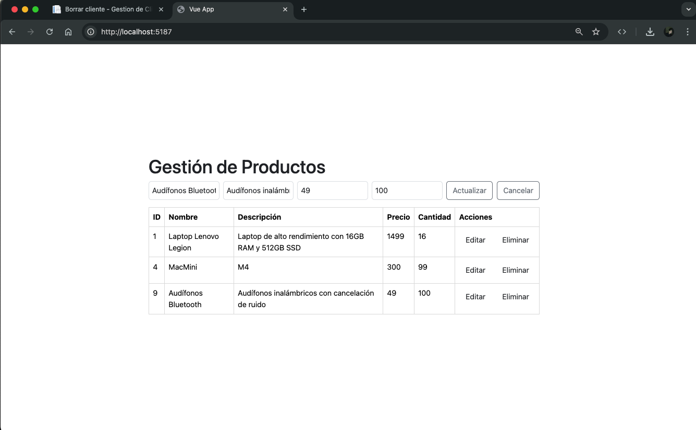

## 🚀 Demo

Puedes probar las aplicaciones desplegadas en los siguientes enlaces:

- 🌐 [Aplicación MVC - prueba1.ricardoall.dev](https://prueba1.ricardoall.dev)
- 📡 [API REST - prueba2y3.ricardoall.dev](https://prueba2y3.ricardoall.dev/api)

---

# Tecnoin - Pruebas Técnicas .NET & Web

Este repositorio contiene tres proyectos desarrollados como parte de una evaluación técnica. Cada uno demuestra el uso de tecnologías específicas del stack Microsoft y del desarrollo web moderno, abordando distintos escenarios:

---

## 📌 1. Prueba Técnica – ASP.NET Web + ADO.NET

Una aplicación web desarrollada en ASP.NET MVC que permite gestionar registros de clientes desde una base de datos relacional mediante ADO.NET.

### Funcionalidades:
- Mostrar una tabla HTML con los registros de la tabla `Clientes` (campos: Id, Nombre, Email).
- Insertar nuevos clientes mediante un formulario validado.
- Eliminar clientes por su Id.
- Mostrar mensajes de éxito o error.

### ✅ Requisitos Técnicos Cumplidos:
- [x] Conexión por ADO.NET o ODBC.
- [x] Separación de lógica de datos en clase independiente.
- [x] Validaciones básicas antes de insertar.
- [x] Uso de parameterized queries (contra SQL Injection).
- [x] Manejo de mensajes para el usuario.
- [x] Creación de tabla `Clientes`.

### 🖼️ Captura de pantalla






---

## 📌 2. Prueba Técnica – API REST en C# con CRUD

Una API RESTful construida con ASP.NET Core para gestionar productos a través de un conjunto completo de operaciones CRUD.

### 🧪 Endpoints implementados:
- `GET /api/productos` → Lista todos los productos.
- `GET /api/productos/{id}` → Devuelve un producto por su Id.
- `POST /api/productos` → Agrega un nuevo producto.
- `PUT /api/productos/{id}` → Edita un producto existente.
- `DELETE /api/productos/{id}` → Elimina un producto.

### 💻 Modelo de datos:
```csharp
public class Producto
{
    public int Id { get; set; }
    public string Nombre { get; set; }
    public string Descripcion { get; set; }
    public double Precio { get; set; }
    public int CantidadEnStock { get; set; }
}
```

---

## 📌 3. Prueba Técnica – Aplicación VueJS integrada en Razor Page

Aplicación frontend desarrollada en VueJS, integrada dentro de una Razor Page para consumir la API de productos y realizar operaciones visuales CRUD.

### Funcionalidades:
- Listado de productos en una tabla HTML.
- Agregar, editar y eliminar productos.
- Formulario con validaciones:
  - El nombre no debe estar vacío.
  - El precio debe ser mayor que cero.
- Botones de acción dentro de la tabla para editar o eliminar productos.

## 🛠️ Cómo ejecutar cada proyecto

Asegúrate de tener instalados **.NET SDK** y **Node.js** (solo si usas herramientas externas para compilar VueJS, aunque en este caso se usó Vue desde CDN).


### 🔒 Seguridad de la base de datos

> Por seguridad, la contraseña de la base de datos **no debe ser escrita directamente en el código fuente**. En su lugar, se debe configurar una **variable de entorno** llamada `MYSQL_PASSWORD`, la cual será utilizada por el proyecto ASP.NET para establecer la conexión con la base de datos.

```cmd:
setx MYSQL_PASSWORD "TuPasswordSegura"
```

```bash:
export MYSQL_PASSWORD="TuPasswordSegura"
```

### 1. ASP.NET MVC (Clientes)
```bash
cd prueba1
dotnet build
dotnet run
```

### 2. API REST (Productos)
```bash
cd prueba2y3
dotnet build
dotnet run
```

### 3. Frontend VueJS (integrado Razor)
Este frontend está integrado directamente en la vista Razor de ASP.NET. Al ejecutar el proyecto de Razor Pages, ya podrás ver la interfaz Vue funcionando:


Luego abre el navegador en:  
📍 `http://localhost:5000/Productos`

---

## 📷 Capturas de pantalla




---

## 🔗 Requisitos

- .NET Core SDK  
- Visual Studio o VS Code  
- MySQL o SQL Server  
- Node.js (opcional para herramientas de build JS)

---

## ✍ Autor

**Ricardo All Ochoa Hernandez**  
[@rockyall](https://github.com/rockyall)
